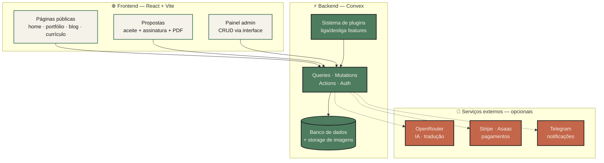
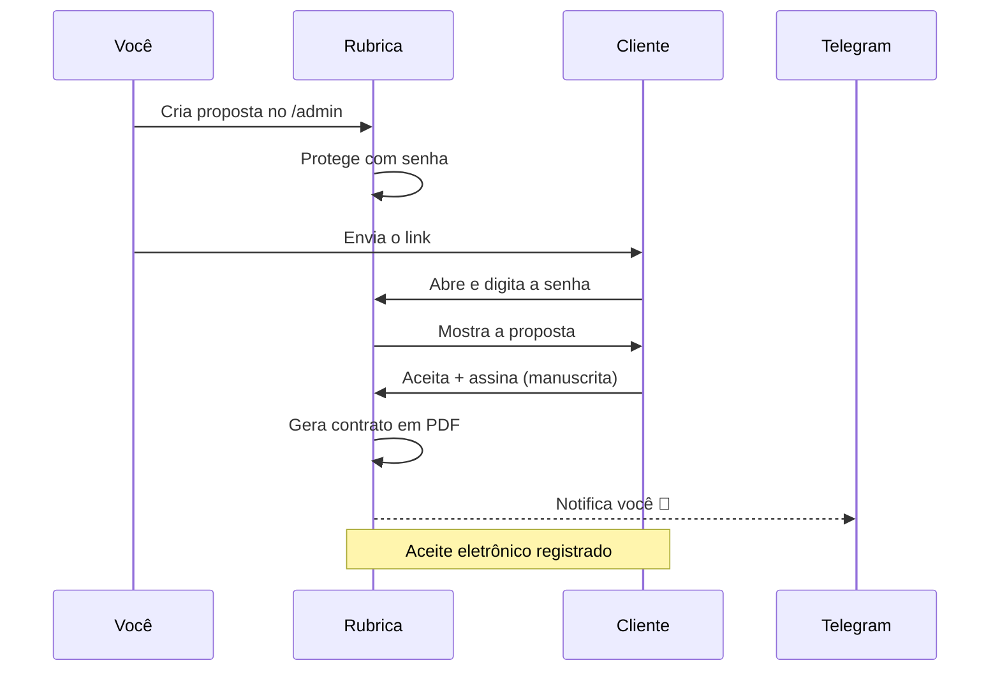

<div align="center">


<br />
<br />

# Rubrica

### _Assine com a sua cara._

Um sistema completo de portfólio profissional — pronto para você forkar, personalizar e publicar com domínio próprio.

<br />

[](./LICENSE)
[](https://convex.dev)
[](https://vercel.com)
[](https://www.typescriptlang.org)

</div>

<br />

## O que é o Rubrica

A maioria das pessoas trava na mesma encruzilhada: começar um portfólio do zero dá trabalho demais, e os construtores prontos deixam todo mundo com a mesma cara.

Rubrica é a base que faltava no meio do caminho. É a estrutura técnica completa — home, portfólio, blog, currículo, propostas comerciais, painel admin, pagamentos — já resolvida. Você não monta o sistema. Você forka, personaliza a identidade e publica.

A base técnica é coletiva. A identidade é sua.

> **Por que isso existe**
>
> Rubrica foi feito para qualquer profissional criativo que leva o próprio trabalho a sério e quer que isso apareça. Dev iniciante ou sênior, designer, freelancer — a fundação já está pronta. Você foca no que importa: o seu conteúdo e a sua marca.
>
> Presença profissional não é luxo. É o mínimo que o seu trabalho merece.

<br />

## O que você coloca no ar

| | Módulo | O que entrega |
|---|---|---|
| 🏠 | **Home** | Hero, sobre, serviços e depoimentos |
| 💼 | **Portfólio** | Filtros por tags, modal detalhado, ordenação por drag-and-drop |
| ✍️ | **Blog** | Editor rich text (TipTap), tags, busca e RSS automático |
| 📄 | **Currículo** | Estruturado, com export em PDF otimizado para ATS |
| 🤝 | **Propostas** | Proteção por senha, aceite eletrônico, assinatura manuscrita e contrato em PDF |
| ⚙️ | **Admin** | CRUD de tudo via interface — sem tocar no código |
| 🧩 | **Plugins** | Liga e desliga features que você não quer expor |
| 🤖 | **IA** _(opcional)_ | Tradução automática e geração de CV otimizado para vagas |
| 💳 | **Pagamentos** _(opcional)_ | Stripe e Asaas (PIX/boleto) |
| 🔔 | **Notificações** _(opcional)_ | Telegram quando alguém aceita uma proposta ou paga |

<br />

## Como funciona

Rubrica tem três camadas: o frontend que o mundo vê, o backend que guarda tudo, e os serviços externos que você liga só se precisar.



<br />

## Pré-requisitos

Antes de começar, você vai precisar de:

- **Node.js 18+** e **pnpm** instalados
- Conta no **[GitHub](https://github.com)** — para fork e deploy contínuo
- Conta no **[Convex](https://convex.dev)** _(gratuita)_ — backend, banco e storage
- Conta no **[Vercel](https://vercel.com)** _(gratuita)_ — hospedagem do frontend
- _(Opcional)_ Contas no **[OpenRouter](https://openrouter.ai)**, **[Stripe](https://stripe.com)**, **[Asaas](https://asaas.com)** ou **[Telegram BotFather](https://t.me/BotFather)** — só se for usar as features opcionais

<br />

## Do clone ao ar

O caminho completo, do fork até o domínio próprio funcionando:

```mermaid
flowchart LR
    A["1 · Fork<br/>+ clone"] --> B["2 · Convex<br/>provisiona backend"]
    B --> C["3 · .env<br/>local"]
    C --> D["4 · Vars no<br/>servidor Convex"]
    D --> E["5 · pnpm dev<br/>roda local"]
    E --> F["6 · Cria usuário<br/>root"]
    F --> G["7 · Preenche<br/>no /admin"]
    G --> H["8 · Personaliza<br/>o visual ⚠️"]
    H --> I["9 · Deploy<br/>no Vercel"]
    I --> J["10 · Domínio<br/>próprio"]

    classDef step fill:#F5F2EA,stroke:#4D7C5F,stroke-width:2px,color:#1A1A18
    classDef highlight fill:#C4664A,stroke:#1A1A18,stroke-width:2px,color:#F5F2EA
    class A,B,C,D,E,F,G,I,J step
    class H highlight
```



> O passo **8 não é opcional**. É o que separa o seu portfólio de "mais um".

### 1 · Fork e clone

```bash
gh repo fork mierzwamatheus/rubrica --clone
cd rubrica
pnpm install
```

### 2 · Provisionar o Convex

O Convex é o backend completo — banco, storage de imagens, autenticação e funções server-side.

```bash
npx convex dev
```

Na primeira vez, o CLI faz tudo sozinho: pede login no navegador, cria o projeto na sua conta, gera o `.env.local` com `VITE_CONVEX_URL` e `CONVEX_DEPLOY_KEY`, sobe o schema e as funções, e fica em modo watch. Deixe rodando enquanto desenvolve.

### 3 · Configurar o `.env` local

```bash
cp .env.example .env
```

Quatro variáveis e a gente explica cada uma:

| Variável | De onde vem | Para quê |
|---|---|---|
| `VITE_CONVEX_URL` | Convex Dashboard → Settings | URL do backend no frontend |
| `CONVEX_URL` | Mesma URL acima | Usado pelos scripts de build (RSS, sitemap) |
| `CONVEX_DEPLOY_KEY` | Convex Dashboard → Settings → Deploy Keys | Necessário para `convex deploy` no build |
| `SITE_URL` | URL final do site | URL canônica do RSS e do sitemap |

### 4 · Variáveis no servidor Convex

Essas ficam **no servidor Convex**, não no `.env` local. Setam-se via CLI:

```bash
npx convex env set NOME_DA_VAR valor
```

**Obrigatória para o sistema rodar:**

- `BOOTSTRAP_ALLOWED=true` — habilita criar o primeiro usuário (você remove depois)

**Obrigatória se usar o plugin `playground`:**

- `PLAYGROUND_KEY_PEPPER=<32+ caracteres aleatórios>` — pepper para fingerprint de API keys

**Opcionais — só se ativar a feature correspondente:**

| Variável | Habilita |
|---|---|
| `OPENROUTER_API_KEY` | Tradução automática + geração de CV com IA |
| `STRIPE_WEBHOOK_SECRET` | Pagamentos via Stripe |
| `ASAAS_WEBHOOK_TOKEN` | Pagamentos via Asaas (PIX/boleto) |
| `TELEGRAM_BOT_TOKEN` | Notificações no Telegram |
| `TELEGRAM_ADMIN_CHAT_ID` | Chat onde as notificações chegam |
| `IMPORT_SECRET` | Endpoint HTTP de importação CSV |
| `VERCEL_WEBHOOK_SECRET` | Webhook de notificação de deploy |

### 5 · Rodar em desenvolvimento

Em outro terminal, com o `npx convex dev` ainda rodando:

```bash
pnpm dev
```

Abre em `http://localhost:3000`.

### 6 · Criar seu usuário root

1. Acesse `http://localhost:3000/login` com `BOOTSTRAP_ALLOWED=true` setado
2. A tela de bootstrap aparece → crie email e senha
3. **Remova o bootstrap imediatamente:**

```bash
npx convex env remove BOOTSTRAP_ALLOWED
```

> ⚠️ Se esquecer essa etapa, qualquer pessoa que descobrir o link consegue criar usuário root no seu sistema.

### 7 · Preencher o conteúdo no admin

Logado em `/admin`, tudo é gerenciado por interface. Você não toca no código para mudar texto, imagem ou dado.

| Rota | O que você configura |
|---|---|
| `/admin/contact` | Nome, email, telefone, avatar, redes sociais |
| `/admin/home` | Texto "sobre", disponibilidade, serviços/skills |
| `/admin/projects` | Projetos do portfólio (imagens, tags, links, case study) |
| `/admin/blog` | Posts (editor rich text, tags, destaque) |
| `/admin/resume` | Currículo (experiências, formação, skills, idiomas, certificações) |
| `/admin/about` | Rotina diária + FAQ |
| `/admin/testimonials` | Depoimentos (curados ou recebidos via wizard público) |
| `/admin/plugins` | **Liga/desliga features** (blog, propostas, pagamentos, etc.) |

### 8 · Personalize o visual _(não pule)_

Esta é a etapa **mais importante** depois do deploy técnico. Identidade visual é o que vai te diferenciar. Onde mexer:

- `src/index.css` — variáveis de cor, tema dark/light, paleta _(o default vem com neon purple `#a855f7` + neon lime — **mude isso**)_
- `src/components/Layout.tsx` — estrutura visual da página
- `src/pages/Home.tsx` — hero, copy, ordem das seções, animações
- `public/favicon.ico` — troque pelo seu logo
- Fontes — importe do Google Fonts no `index.html` ou via Tailwind
- `src/components/ui/` — componentes shadcn/ui, fáceis de customizar

Teste com `pnpm dev` enquanto altera. Não suba sem dar a sua cara.

### 9 · Deploy no Vercel

1. Em [vercel.com/new](https://vercel.com/new), importe o repositório forkado
2. **Framework preset:** Vite
3. **Build command:** já vem no `vercel.json` (`pnpm convex deploy && pnpm vite build`) — não mude
4. **Output directory:** `dist`
5. **Adicione as env vars** (Settings → Environment Variables): `VITE_CONVEX_URL`, `CONVEX_URL`, `CONVEX_DEPLOY_KEY` _(sem essa, o build falha)_ e `SITE_URL`
6. Clique em **Deploy**

A partir daqui, todo `git push` na branch principal dispara um deploy automático.

### 10 · Domínio próprio

1. **Vercel → seu projeto → Settings → Domains → Add Domain**
2. Adicione `seudominio.com` e `www.seudominio.com`
3. **Configure o DNS** no seu registrador (Registro.br, Cloudflare, GoDaddy…):
   - Raiz (`seudominio.com`): registro **A** → `76.76.21.21`
   - `www`: registro **CNAME** → `cname.vercel-dns.com`
4. Aguarde a propagação (minutos a horas)
5. O SSL é emitido automaticamente pela Vercel via Let's Encrypt
6. **Atualize a `SITE_URL`** no Vercel para a URL final
7. Force um redeploy para regenerar `sitemap.xml` e `rss.xml`

<br />

## O fluxo de propostas

É aqui que o Rubrica vira ferramenta de fechar negócio, não só de mostrar trabalho. Da criação ao contrato assinado:



<br />

## Quando ativar cada feature opcional

| Feature | Plugin (`/admin/plugins`) | Env vars | Conta externa |
|---|---|---|---|
| Pagamentos via Stripe | `payments` | `STRIPE_WEBHOOK_SECRET` | Stripe |
| Pagamentos PIX/Boleto | `payments` | `ASAAS_WEBHOOK_TOKEN` | Asaas |
| Geração de CV com IA | `ai-resumes` | `OPENROUTER_API_KEY` | OpenRouter |
| Tradução automática (i18n) | `i18n` | `OPENROUTER_API_KEY` | OpenRouter |
| Notificações Telegram | _(built-in)_ | `TELEGRAM_BOT_TOKEN` + `TELEGRAM_ADMIN_CHAT_ID` | BotFather |

> **Quer só o básico?** Se você quer apenas home + projetos + currículo, desative blog, propostas, pagamentos, IA e playground em `/admin/plugins`. As rotas somem da sidebar e do roteador.

<br />

## Scripts úteis

```bash
pnpm dev          # dev local + convex em watch (porta 3000)
pnpm build        # convex deploy + RSS + sitemap + vite build
pnpm preview      # preview do build de produção
pnpm check        # type-check (tsc --noEmit)
pnpm format       # prettier
pnpm test         # vitest
```

<br />

## Estrutura do projeto

```
rubrica/
├── convex/              # Backend: schema, queries, mutations, actions
├── src/
│   ├── pages/           # Páginas públicas + /admin/*
│   ├── components/      # Componentes (UI, admin, layout)
│   ├── contexts/        # AuthContext, ThemeContext, PluginsContext
│   └── index.css        # ← Personalize cores e tema aqui
├── scripts/             # Build-time: RSS, sitemap, fetch de dados estáticos
├── public/              # Assets estáticos (favicon, dados gerados)
├── docs/features.md     # Referência técnica completa
├── .env.example         # Template de variáveis de ambiente
└── vercel.json          # Build command, rewrites SPA, security headers
```

> Procurando a referência técnica detalhada — schema do banco, lista de features, rotas, plugins, design system? Veja [`docs/features.md`](./docs/features.md).

<br />

## Troubleshooting

| Sintoma | Causa provável |
|---|---|
| `convex deploy` falha no Vercel | Falta `CONVEX_DEPLOY_KEY` nas env vars do Vercel |
| Login não funciona / bootstrap não aparece | `BOOTSTRAP_ALLOWED` removido antes de criar o primeiro usuário — sete de novo, crie e remova |
| Plugin desativado ainda aparece em produção | Falta um redeploy para regenerar `public/data/plugins.json` |
| Notificações Telegram não chegam | Você ainda não enviou `/start` para o seu bot |
| Imagens quebradas após deploy | IDs do Convex Storage são por deployment; ao migrar dev → prod, reupload é necessário |

<br />

## Uma palavra antes de você publicar

Rubrica não é produto de empresa. É infraestrutura de comunidade. Quanto mais gente usa, melhora e distribui, mais sobe o nível médio de como profissionais se apresentam na web.

Mas portfólio sem cara é portfólio igual. Use a base sem culpa — e use bem. Gaste o tempo que economizou na sua identidade visual e na sua copy. É ali que mora a diferença entre "mais um" e um portfólio que marca.

Se o Rubrica te ajudou, considere mandar um PR. O objetivo é coletivo.

<br />

## Licença

GNU GPL v3.0 — veja [`LICENSE`](./LICENSE).

<br />

<div align="center">

Feito com ❤️ por **[Matheus Mierzwa](https://github.com/MierzwaMatheus)**

_Assine com a sua cara._

</div>